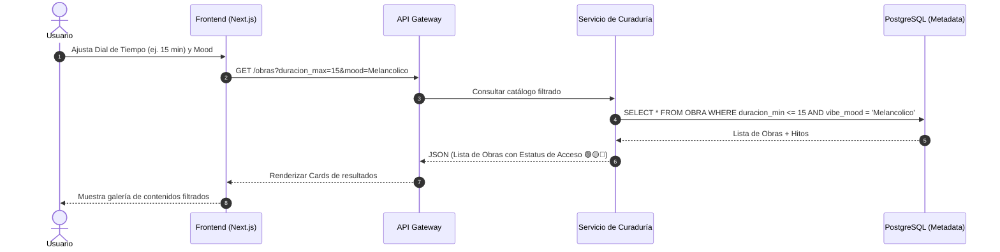
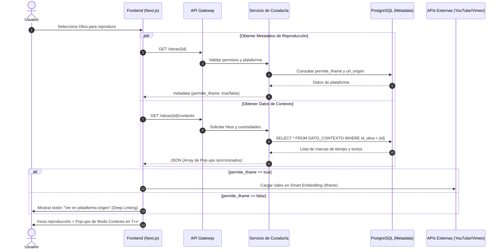
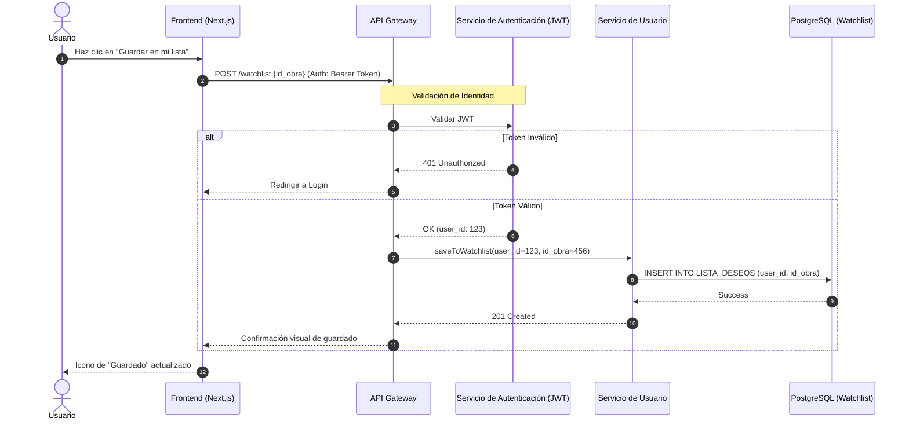

# **Diagramas de secuencia principales**

Aquí están los diagramas de secuencia detallados para las tres operaciones críticas de **arteflujo**. Estos diagramas ilustran la interacción entre los microservicios, la validación de seguridad y la integración con fuentes de contenido externas.

### ---

**1\. Búsqueda Curada (El Dial de Tiempo)**

Este flujo muestra cómo el sistema filtra contenido basado en la duración y el estado de ánimo, priorizando la velocidad de respuesta mediante el uso de la base de datos de metadatos indexados.

Fragmento de código

### ---

**2\. Reproducción Inteligente y Modo Contexto**

Este es el flujo más complejo, donde el sistema decide la técnica de visualización y prepara la capa de información educativa sincronizada.

Fragmento de código

### ---

**3\. Persistencia en Watchlist**

Este flujo valida la seguridad del sistema mediante la verificación de tokens antes de realizar operaciones de escritura en el perfil del usuario.

Fragmento de código

### ---

**Puntos de Decisión Críticos en los Diagramas:**

* **En el Diagrama 2 (Reproducción):** Se utiliza una ejecución en paralelo (par) para cargar los metadatos de acceso y los datos del **Modo Contexto** simultáneamente, reduciendo el tiempo de carga percibido por el usuario.  
* **En el Diagrama 3 (Watchlist):** El **API Gateway** actúa como primer filtro de seguridad, delegando la validación del token al servicio de identidad antes de permitir cualquier cambio en la base de datos de usuarios.

