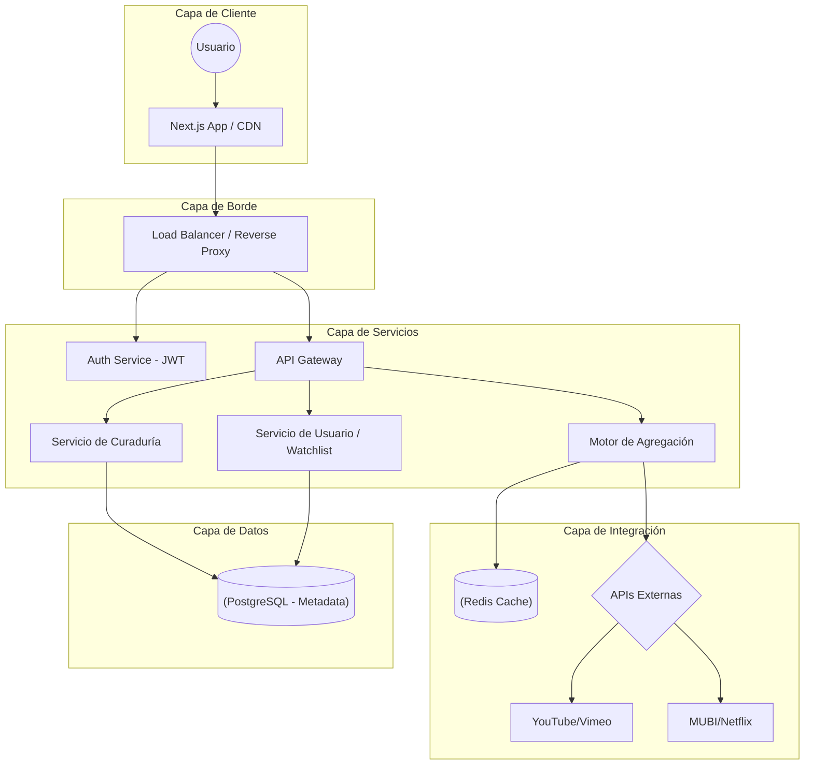

Como **Senior Solutions Architect**, presento la propuesta técnica para **latearte**, un Hub de Curaduría Cultural diseñado para ofrecer una experiencia de descubrimiento artístico fluida y de alta especialidad.

## ---

**🏗️ 1\. Arquitectura de Alto Nivel: Microservicios Orientados a Eventos**

He seleccionado una arquitectura de **Microservicios (Container-based)** debido a la necesidad de **escalabilidad independiente** y la integración crítica con múltiples APIs externas.

* **Justificación:** El **Motor de Agregación** requiere procesos pesados de indexación que no deben afectar la latencia del **Frontend**. El uso de microservicios permite escalar el servicio de "Escenarios" o "Cine" de forma aislada durante picos de tráfico por estrenos.

La arquitectura de **arteflujo** está diseñada bajo un patrón de **Microservicios Orientados a Eventos**, organizada en cuatro capas principales para asegurar escalabilidad y resiliencia:

### **Capas del Sistema**

* **Capa de Cliente y Edge:** El usuario accede a través de una aplicación **Next.js** optimizada con un **CDN** para entrega rápida de contenido estático. Las peticiones son recibidas por un **Balanceador de Carga / Reverse Proxy** que distribuye el tráfico y protege los servicios internos.  
* **Capa de Servicios (Lógica de Negocio):** Un **API Gateway** actúa como punto de entrada único, redirigiendo las solicitudes a microservicios especializados:  
  * **Servicio de Autenticación:** Gestiona la seguridad mediante tokens JWT.  
  * **Servicio de Curaduría:** Maneja la lógica del "Dial de Tiempo", "Moods" y metadatos artísticos o "Hitos" (premios).  
  * **Motor de Agregación:** El componente crítico que orquesta la comunicación con fuentes externas. Maneja la comunicación con YouTube, MUBI, Vimeo, etc., y gestiona el **Smart Embedding**.  
  * **Servicio de Usuario:** Administra los perfiles y la persistencia de las *Watchlists*.  
* **Capa de Integración:** El Motor de Agregación se conecta con las **APIs de terceros** (YouTube, MUBI, Vimeo, etc.). Utiliza una capa de **Caché (Redis)** para almacenar metadatos frecuentes, optimizando el uso de cuotas de las APIs y mejorando los tiempos de respuesta.  
* **Capa de Datos:** Se utiliza **PostgreSQL** como base de datos centralizada para mantener la integridad referencial de las obras, hitos y datos de contexto. Además se tiene una capa de **Caché (Redis)** para resultados de búsqueda frecuentes y estados de acceso.

## 

## ---

**🛠️ 2\. Stack Tecnológico Recomendado**

* **Frontend:** **Next.js (React)**. Esencial para el **SEO** de películas y cortos, permitiendo Server-Side Rendering (SSR) para las fichas técnicas.  
* **Backend:** **Node.js (NestJS)**. Ideal para manejar múltiples peticiones asíncronas a APIs de terceros de forma eficiente.  
* **Base de Datos:** **PostgreSQL**. Garantiza la integridad referencial entre Obras, Hitos y Datos de Contexto.  
* **Caché/Mensajería:** **Redis** para sesiones y **RabbitMQ/Kafka** para sincronizar actualizaciones de catálogos externos.

### ---

**3\. Estructura de Ficheros Propuesta**

Siguiendo el stack tecnológico recomendado (**Next.js** para el frontend y **NestJS/Node.js** para el backend), esta es la organización de carpetas sugerida:

```text
latearte-project/  
├── frontend/                 # Proyecto Next.js (React)  
│   ├── public/               # Activos estáticos (logos, iconos de acceso 🟢🟡🔵)  
│   ├── src/  
│   │   ├── components/       # UI: Dial de Tiempo, Card Design, Reproductor Modal  
│   │   ├── hooks/            # Lógica compartida y estado global  
│   │   ├── pages/            # Rutas: Home, Cinema, Stage, Short List, Watchlist  
│   │   ├── services/         # Clientes para consumir el API Gateway interno  
│   │   ├── styles/           # Temas y estilos CSS/Tailwind  
│   │   └── utils/            # Formateadores de tiempo y lógica de filtrado  
│   ├── next.config.js  
│   └── package.json  
│  
├── backend/                  # Proyecto NestJS (Node.js)  
│   ├── src/  
│   │   ├── modules/          # Microservicios modulares  
│   │   │   ├── aggregator/   # Lógica de indexación y Smart Embedding  
│   │   │   ├── auth/         # Gestión de sesiones y JWT  
│   │   │   ├── curated/      # Gestión de Obras, Hitos y Moods  
│   │   │   └── user/         # Gestión de perfiles y Listas de Deseos  
│   │   ├── common/           # Filtros de excepción, interceptores y DTOs  
│   │   ├── config/           # Variables de entorno y llaves de APIs externas  
│   │   └── database/         # Migraciones y modelos de PostgreSQL  
│   ├── test/                 # Pruebas unitarias y de integración  
│   ├── nest-cli.json  
│   └── package.json  
│  
└── README.md                 # Documentación técnica general
```

Esta estructura separa claramente las responsabilidades, permitiendo que el **Motor de Agregación** en el backend evolucione independientemente de la interfaz de usuario en el frontend.

---

### **4\. Estrategia de Pruebas: Calidad y Resiliencia**

Para asegurar que la experiencia en **arteflujo** sea verdaderamente "premium" y libre de fricciones, la estrategia de pruebas se ha diseñado siguiendo el modelo de la pirámide de automatización, con un enfoque especial en la resiliencia de las integraciones externas.

#### 

#### **1\. Pruebas Unitarias (Capa de Lógica)**

* **Backend:** Se validará de forma aislada la lógica de los servicios de curaduría, asegurando que el cálculo de duraciones y la asignación de "moods" sea correcto según el diccionario de datos.  
* **Frontend:** Pruebas de componentes individuales en **React/Next.js**, como el funcionamiento mecánico del "Dial de Tiempo" y el renderizado correcto de los iconos de acceso (🟢, 🟡, 🔵).  
* **Mocking de APIs:** Se utilizarán herramientas para simular las respuestas de YouTube, MUBI y Vimeo, evitando consumir cuotas reales durante el desarrollo y asegurando que el sistema maneje correctamente metadatos incompletos.

#### **2\. Pruebas de Integración (Capa de Datos y APIs)**

* **Consistencia de Metadatos:** Verificación de que la relación entre la entidad **OBRA** y sus **HITOS** (premios) o **DATOS\_CONTEXTO** se mantenga íntegra en PostgreSQL.  
* **Validación de Smart Embedding:** Pruebas automatizadas para confirmar que los *iframes* de terceros se cargan correctamente y que el sistema detecta si un video permite ser embebido o requiere *Deep Linking*.  
* **Circuit Breaker Testing:** Simulación de caídas en APIs externas para verificar que el backend responda con contenido alternativo o estados de "No disponible" sin degradar la plataforma completa.

#### **3\. Pruebas de Extremo a Extremo (E2E \- Flujos de Usuario)**

* **Flujo de Descubrimiento:** Automatización del recorrido donde un usuario ajusta el filtro por tiempo, selecciona un "mood" y visualiza resultados coherentes.  
* **Persistencia en Watchlist:** Validación de que el guardado de una obra desde diversas fuentes se refleje instantáneamente en el perfil del usuario.  
* **Sincronización del Modo Contexto:** Pruebas de tiempo para asegurar que los pop-ups informativos aparezcan en la marca de tiempo exacta definida en la entidad **DATO\_CONTEXTO**.

#### **4\. Pruebas de Carga y Rendimiento**

* **Ráfagas de Tráfico:** Simulación de usuarios concurrentes durante eventos especiales (como anuncios de cortos premiados) para validar el auto-escalado en **AWS Fargate**.  
* **Latencia de Búsqueda:** Medición de los tiempos de respuesta del API Gateway y la eficiencia de la caché en **Redis** al consultar catálogos indexados.

---

### **Resumen de Herramientas de Testing**

| Nivel de Prueba | Herramienta Recomendada | Objetivo Principal |
| :---- | :---- | :---- |
| **Unitarias (BE)** | Jest / NestJS Testing | Validar lógica de negocio y DTOs. |
| **Unitarias (FE)** | React Testing Library | Asegurar interactividad del "Dial" y UI. |
| **E2E / UI** | Playwright o Cypress | Probar flujos completos y reproducción. |
| **Carga** | K6 o JMeter | Estresar el Motor de Agregación. |
| **Contratos API** | Pact | Asegurar compatibilidad con APIs de terceros. |

## 

## 

## ---

**🔄 5\. Estrategia de Integración y Resiliencia**

Para gestionar las cuotas de APIs y la disponibilidad de fuentes externas:

* **Circuit Breaker:** Si una API (ej. Vimeo) falla repetidamente, el sistema marca temporalmente el contenido como "No disponible" o redirige a una fuente alterna sin caerse.  
* **Caché de Metadatos:** No se consulta la API externa en cada búsqueda; se indexan los metadatos y se actualizan mediante un *cron job* nocturno para respetar los límites de cuota.  
* **Validación de Enlaces:** Un servicio en segundo plano verifica periódicamente que los enlaces de **Deep Linking** sigan activos.

## ---

**🔐 6\. Seguridad y Monetización**

* **Watchlists:** Las sesiones se gestionan mediante **JWT (JSON Web Tokens)** almacenados de forma segura.  
* **Afiliados:** Los enlaces a plataformas como MUBI o Netflix incluyen parámetros de rastreo inyectados dinámicamente por el Backend al generar el **Botón de Play**.  
* **Protección:** Implementación de **WAF (Web Application Firewall)** para mitigar ataques de scraping al catálogo curado.

### **Ampliación de la Capa de Seguridad**

La estrategia de seguridad se divide en cuatro pilares fundamentales para garantizar la confianza del usuario y la protección de los activos digitales:

#### **1\. Gestión de Identidades y Control de Acceso (IAM)**

* **Autenticación Robusta:** Se implementará **JSON Web Tokens (JWT)** para la gestión de sesiones sin estado, permitiendo que los microservicios validen la identidad del usuario de forma independiente. Para el futuro, se contempla la integración de **OAuth2/OpenID Connect** (Google/Apple ID) para facilitar el registro de los "Curiosos Culturales".  
* **Autorización Basada en Roles (RBAC):** Se definirán niveles de acceso específicos:  
  * **Usuario:** Acceso a su *Watchlist* y personalización de *Moods*.  
  * **Curador/Admin:** Permisos para gestionar el catálogo, actualizar "Hitos" y moderar los "Datos de Contexto".  
* **Seguridad en el API Gateway:** El Gateway actuará como el único punto de entrada, validando firmas de tokens y scopes antes de redirigir el tráfico a los microservicios internos.

#### **2\. Protección de Datos y Privacidad**

* **Cifrado de Extremo a Extremo:** Toda la comunicación entre el cliente y el servidor, así como entre microservicios, se realizará mediante **TLS 1.3 (HTTPS)**.  
* **Datos en Reposo:** La base de datos **PostgreSQL** contará con cifrado de disco (AES-256) para proteger la información de los perfiles y las listas de deseos.  
* **Gestión de Secretos:** Las llaves de API de terceros (YouTube, Vimeo, MUBI) y las credenciales de base de datos nunca se almacenarán en el código fuente; se utilizarán servicios como **AWS Secrets Manager** o **HashiCorp Vault**.

#### **3\. Seguridad en Integraciones y Monetización**

* **Integridad de Enlaces de Afiliación:** Para evitar el fraude o la manipulación de enlaces de pago (VOD/Suscripción), el sistema generará y firmará dinámicamente los parámetros de afiliado en el backend justo antes de la redirección.  
* **Validación de Origen (CORS):** Se configurarán políticas estrictas de *Cross-Origin Resource Sharing* para asegurar que solo el frontend oficial de **arteflujo** pueda consumir los recursos del API Gateway.  
* **Sanitización de Contenido:** Debido a que la plataforma permite "Datos de Contexto" y descripciones culturales, se implementará una limpieza estricta contra ataques **XSS (Cross-Site Scripting)** en el renderizado de pop-ups y fichas técnicas.

#### **4\. Resiliencia y Defensa Perimetral**

* **Mitigación de DDoS y Scraping:** Se utilizará un **Web Application Firewall (WAF)** para bloquear patrones de tráfico maliciosos y proteger el catálogo curado de bots que intenten extraer la base de datos de "Hitos" y premios.  
* **Rate Limiting:** Se aplicarán límites de tasa por IP y por usuario para prevenir abusos en el motor de búsqueda y proteger las cuotas de las APIs externas.  
* **Aislamiento de Red:** Los microservicios y la base de datos residirán en una **VPC (Virtual Private Cloud)** privada, sin exposición directa a Internet, comunicándose únicamente a través del Load Balancer y el API Gateway.

## ---

**📋 7\. Flujo de Datos: Búsqueda y Guardado**

**Escenario:** *Usuario busca un corto de 15 min de MUBI y lo guarda en su lista.*

1. **Filtro:** El usuario ajusta el **Dial de Tiempo** a 15 min y selecciona la plataforma MUBI.  
2. **Consulta:** El Frontend solicita al API Gateway los contenidos. El servicio de búsqueda consulta el índice en **PostgreSQL/ElasticSearch** filtrando por duracion\_min \<= 15\.  
3. **Visualización:** Se retorna la **Card** con el sello de "Suscripción" (🟡) y el logo de MUBI.  
4. **Acción:** El usuario hace clic en "Guardar". La petición viaja al **Servicio de Usuario**, que inserta el id\_obra y id\_usuario en la tabla **LISTA\_DESEOS**.

## ---

**📊 8\. Diagrama del Sistema (Mermaid)**



## ---

**☁️ 9\. Propuesta de Infraestructura (AWS)**

* **Computación:** **AWS Fargate (ECS)** para ejecutar los microservicios en contenedores sin gestionar servidores.  
* **Almacenamiento:** **Amazon RDS (PostgreSQL)** para el modelo de datos y **Amazon ElastiCache** para Redis.  
* **Red y Seguridad:** **Amazon CloudFront** como CDN y **AWS WAF** para proteger el API Gateway.  
* **Eventos:** **Amazon SNS/SQS** para la comunicación asíncrona entre el agregador y el servicio de notificaciones.

