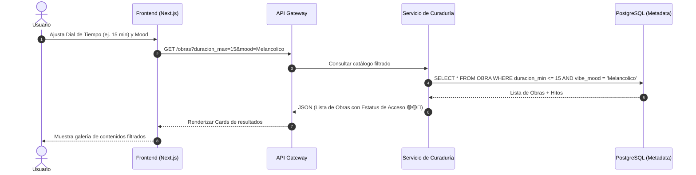
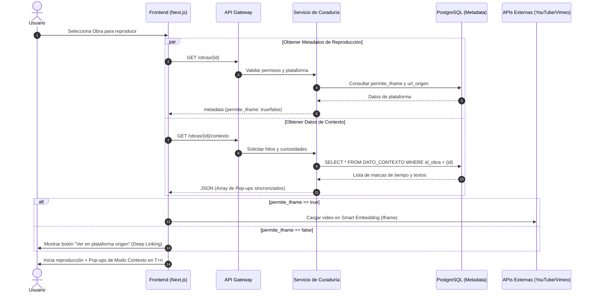
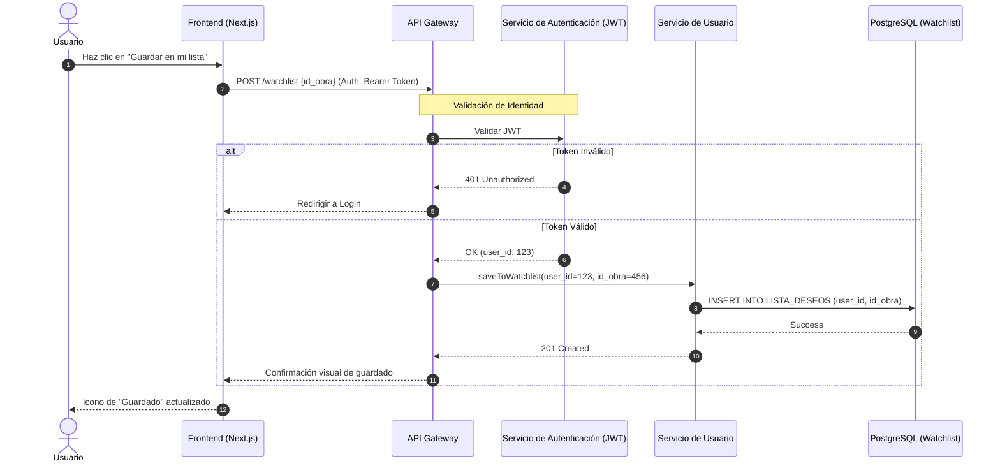
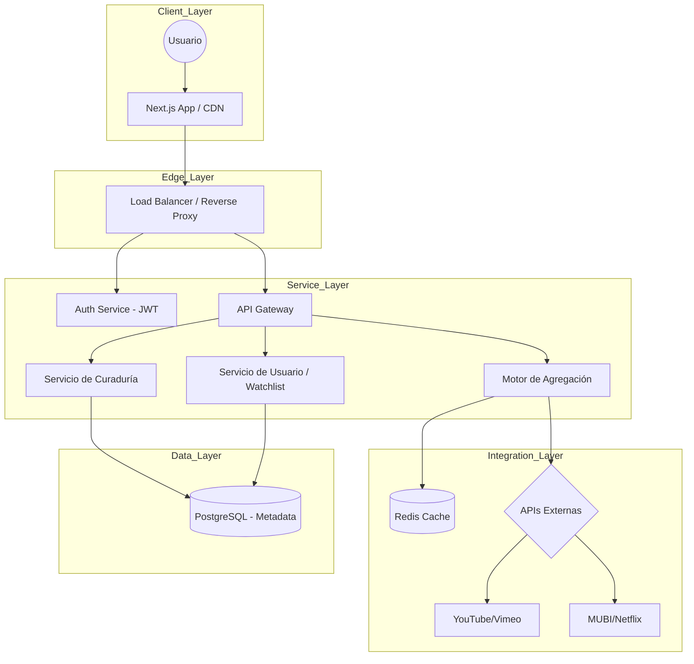

## Índice

0. [Ficha del proyecto](#0-ficha-del-proyecto)
1. [Descripción general del producto](#1-descripción-general-del-producto)
2. [Arquitectura del sistema](#2-arquitectura-del-sistema)
3. [Modelo de datos](#3-modelo-de-datos)
4. [Especificación de la API](#4-especificación-de-la-api)
5. [Historias de usuario](#5-historias-de-usuario)
6. [Tickets de trabajo](#6-tickets-de-trabajo)
7. [Pull requests](#7-pull-requests)

---

## 0. Ficha del proyecto

### **0.1. Tu nombre completo:**
William Alberto Orejuela Rios

### **0.2. Nombre del proyecto:**
Sitio web LateArte

### **0.3. Descripción breve del proyecto:**
Latearte (un hub) donde lo artístico late con fuerza, es punto de encuentro con las artes, el ingenio y la creatividad; es una plataforma web de streaming de alta especialidad diseñada para el consumo de contenidos culturales, independientes, de prestigio y de contenidos ingeniosos, audaces y creativos.

### **0.4. URL del proyecto:**
https://latearte.com/

### 0.5. URL o archivo comprimido del repositorio
https://github.com/williamorejuela/LateArte


---

## 1. Descripción general del producto

Lugar para conectar con contenidos artísticos, para entremezclar ideas nuevas con contenidos destacados; presentar una alternativa refrescante al "scroll" infinito de las plataformas comerciales. Se busca crear una plataforma de curaduría premium, donde se selecciona, organiza y gestiona contenidos artísticos, un refugio para quienes buscan calidad artística sobre cantidad algorítmica.

Se quiere crear un **Meta-Buscador Especializado** o un **Hub de Curaduría**, que resuelva el problema de la fragmentación: el usuario no tiene que saltar de app en app para saber dónde conectar con la cultura y el arte. 

Se quiere presentar al usuario contenido gratuito, acceder de forma integrada a algunos contenidos y además presentar opciones de contenido de pago, y que las pueda distinguir fácilmente.

### **1.1. Objetivo:**

* **Objetivo General:** Crear un ecosistema digital que centralice y clasifique el contenido cultural y artístico de alta calidad disperso en la web, facilitando el descubrimiento y el acceso directo.  
* **Objetivos Específicos:**  
  * **Curaduría sobre Cantidad:** Filtrar solo contenido con valor artístico (premiados, cine de autor, música académica/selecta).  
  * **Transparencia de Acceso:** Informar claramente al usuario si el contenido es gratuito, bajo suscripción (Netflix, MUBI, Qello) o de pago por evento (VOD).  
  * **Experiencia Fluida:** Reducir la fricción mediante la reproducción embebida siempre que las licencias y APIs lo permitan.

### **1.2. Pilares del Contenido**

La oferta se divide en tres ejes verticales que definen la identidad de la aplicación:

* **Cortos y cortometrajes (The Short List):** Una colección de piezas breves, ingeniosas y vanguardistas. Con dos líneas:  
  *  El enfoque principal son obras premiadas en festivales internacionales o nominadas por la Academia (**Oscars**), garantizando una experiencia de alto impacto en poco tiempo.  
  * Cortos y animaciones frescas, ingeniosas, creativas, nuevas propuestas. La parte más dinámica que se conecte con la búsqueda de experiencias nuevas, que sorprendan.  
* **Escenarios (The Stage):** Un espacio dedicado a la música y las artes escénicas. No solo conciertos completos, sino **curaduría de fragmentos magistrales** (la "pieza de oro" de una presentación). Abarca desde la potencia de una orquesta sinfónica hasta la intimidad de un club de Jazz o un bolero.  
* **Cine de Autor (The Cinema):** Un catálogo alejado del *blockbuster*. Se centra en el cine de festivales (Cannes, Berlinale, etc.), cine independiente y obras que alimentan la **"Cinefilia Pura"**, donde la visión del director es el eje central.

### **1.3. Perfil del Usuario Objetivo**

* **El Curioso Cultural:** Personas que buscan aprender o descubrir algo nuevo en sus tiempos libres.  
* **El Melómano y Amante del Arte:** Usuarios que valoran la interpretación técnica, desde un solo de violín hasta una puesta en escena teatral.  
* **Cinefilitas:** Espectadores que huyen de los clichés de Hollywood y buscan profundidad temática.


### **1.4. Características Principales**

* **Agregación Inteligente:** La plataforma no solo aloja, sino que indexa contenido de terceros (YouTube, Vimeo, plataformas de nicho).  
* **Etiquetado de "Estatus de Acceso":** Un sistema de iconos visuales que indica:  
  * 🟢 **Abierto:** Contenido gratuito o de dominio público.  
  * 🟡 **Suscripción:** Requiere cuenta en una plataforma externa.  
  * 🔵 **Premium/VOD:** Pago único por alquiler o compra.  
* **Reproductor Unificado:** Capacidad de embeber marcos de reproducción para que el usuario no abandone la web (sujeto a disponibilidad técnica del origen).

### **1.5. Funcionalidades Detalladas**

#### **A. Módulo de Usuario y Navegación**

* **Filtros de "Costo":** Opción para mostrar solo contenido gratuito o contenido disponible en las plataformas que el usuario ya paga.  
* **Buscador por "Hito":** Permitir búsquedas como "Nominados Oscar 2024" o "Jazz Instrumental en vivo".  
* **Listas de Deseos (Watchlist):** Guardar contenido de diferentes fuentes en una sola lista personalizada.

#### **B. Visualización de Resultados (Card Design)**

Cada miniatura de video debe mostrar:

1. **Título y Director/Artista.**  
2. **Sello de Calidad:** (Ej: "Ganador Cannes", "Nominado Oscar", "Versión Sinfónica").  
3. **Indicador de Plataforma:** Logo de la fuente original (Ej: YouTube, Vimeo, MUBI).  
4. **Tipo de Acceso:** Texto o icono que indique si es pago o gratuito.

#### **C. Funcionalidades Técnicas de Reproducción**

* Smart Embedding: Si el video permite iframe (como YouTube o Vimeo), se reproduce en una ventana modal dentro de Artesir.  
* **Deep Linking:** Si el contenido es de una plataforma cerrada (como Netflix o Apple TV), el botón de "Play" abre directamente la aplicación o la web externa en el minuto exacto.

### **1.6. Estructura de Secciones (Matriz de Contenido)**

| Sección | Funcionalidad Específica | Subcategorías / Géneros | Atributo Diferencial | Ejemplo de Contenido |
| :---- | :---- | :---- | :---- | :---- |
| **Cortos** | Botón de "Sorpréndeme" (Random Play). | Animación, Ficción, Documental, Curiosidades. | Calidad premiada (Oscar/Festivales).Cortos nuevos, audaces, creativos, resaltados en listas artísticas o culturales. | Cortometrajes de animación de festivales. Propuestas nuevas, ingeniosas, creativas. |
| **Conciertos** | Selector de "Solo Fragmentos" o "Concierto Completo". | Sinfónico, Ópera, Teatro, Homenajes, Jazz, Salsa, Rock, Pop. | Versiones instrumentales y "**highlights**". | El solo de trompeta de un concierto de Jazz. |
| **Cine** | Ficha técnica con enfoque en el estilo visual. | Cine de Autor, Independiente, Cine Cultural. | Narrativas no convencionales. | Películas de cine independiente o experimental. |

### **1.7. Reglas de Negocio**

* **Prioridad de Visualización:** El contenido gratuito y embebible tendrá prioridad en los algoritmos de recomendación para mejorar la retención del usuario en la web.  
* **Afiliación:** Enlaces a plataformas de pago podrán incluir códigos de afiliado para monetizar la plataforma.


### **1.8.🔄 Diagramas de secuencia**
Estos son los diagramas de secuencia detallados para las tres operaciones críticas de **arteflujo**. Estos diagramas ilustran la interacción entre los microservicios, la validación de seguridad y la integración con fuentes de contenido externas.

**1.8.1. Búsqueda Curada (El Dial de Tiempo)**

Este flujo muestra cómo el sistema filtra contenido basado en la duración y el estado de ánimo, priorizando la velocidad de respuesta mediante el uso de la base de datos de metadatos indexados.



---

**1.8.2. Reproducción Inteligente y Modo Contexto**

Este es el flujo más complejo, donde el sistema decide la técnica de visualización y prepara la capa de información educativa sincronizada.



---

**1.8.3. Persistencia en Watchlist**

Este flujo valida la seguridad del sistema mediante la verificación de tokens antes de realizar operaciones de escritura en el perfil del usuario.



---

**Puntos de Decisión Críticos en los Diagramas:**

* **En el Diagrama 2 (Reproducción):** Se utiliza una ejecución en paralelo (par) para cargar los metadatos de acceso y los datos del **Modo Contexto** simultáneamente, reduciendo el tiempo de carga percibido por el usuario.  
* **En el Diagrama 3 (Watchlist):** El **API Gateway** actúa como primer filtro de seguridad, delegando la validación del token al servicio de identidad antes de permitir cualquier cambio en la base de datos de usuarios.


---

## **🏗️2. Arquitectura del sistema, de Alto Nivel: Microservicios Orientados a Eventos**

He seleccionado una arquitectura de **Microservicios (Container-based)** debido a la necesidad de **escalabilidad independiente** y la integración crítica con múltiples APIs externas.

* **Justificación:** El **Motor de Agregación** requiere procesos pesados de indexación que no deben afectar la latencia del **Frontend**. El uso de microservicios permite escalar el servicio de "Escenarios" o "Cine" de forma aislada durante picos de tráfico por estrenos.

La arquitectura de **arteflujo** está diseñada bajo un patrón de **Microservicios Orientados a Eventos**, organizada en cuatro capas principales para asegurar escalabilidad y resiliencia:

### **2.1 Capas del Sistema**

* **Capa de Cliente y Edge:** El usuario accede a través de una aplicación **Next.js** optimizada con un **CDN** para entrega rápida de contenido estático. Las peticiones son recibidas por un **Balanceador de Carga / Reverse Proxy** que distribuye el tráfico y protege los servicios internos.  
* **Capa de Servicios (Lógica de Negocio):** Un **API Gateway** actúa como punto de entrada único, redirigiendo las solicitudes a microservicios especializados:  
  * **Servicio de Autenticación:** Gestiona la seguridad mediante tokens JWT.  
  * **Servicio de Curaduría:** Maneja la lógica del "Dial de Tiempo", "Moods" y metadatos artísticos o "Hitos" (premios).  
  * **Motor de Agregación:** El componente crítico que orquesta la comunicación con fuentes externas. Maneja la comunicación con YouTube, MUBI, Vimeo, etc., y gestiona el **Smart Embedding**.  
  * **Servicio de Usuario:** Administra los perfiles y la persistencia de las *Watchlists*.  
* **Capa de Integración:** El Motor de Agregación se conecta con las **APIs de terceros** (YouTube, MUBI, Vimeo, etc.). Utiliza una capa de **Caché (Redis)** para almacenar metadatos frecuentes, optimizando el uso de cuotas de las APIs y mejorando los tiempos de respuesta.  
* **Capa de Datos:** Se utiliza **PostgreSQL** como base de datos centralizada para mantener la integridad referencial de las obras, hitos y datos de contexto. Además se tiene una capa de **Caché (Redis)** para resultados de búsqueda frecuentes y estados de acceso.

## 

## ---

**🛠️ 2.2 Stack Tecnológico Recomendado**

* **Frontend:** **Next.js (React)**. Esencial para el **SEO** de películas y cortos, permitiendo Server-Side Rendering (SSR) para las fichas técnicas.  
* **Backend:** **Node.js (NestJS)**. Ideal para manejar múltiples peticiones asíncronas a APIs de terceros de forma eficiente.  
* **Base de Datos:** **PostgreSQL**. Garantiza la integridad referencial entre Obras, Hitos y Datos de Contexto.  
* **Caché/Mensajería:** **Redis** para sesiones y **RabbitMQ/Kafka** para sincronizar actualizaciones de catálogos externos.

### ---

**2.3 Estructura de Ficheros Propuesta**

Siguiendo el stack tecnológico recomendado (**Next.js** para el frontend y **NestJS/Node.js** para el backend), esta es la organización de carpetas sugerida:

```plaintext
arteflujo-project/
├── frontend/                 # Proyecto Next.js (React)
│   ├── public/               # Activos estáticos (logos, iconos de acceso 🟢🟡🔵)
│   ├── src/
│   │   ├── components/       # UI: Dial de Tiempo, Card Design, Reproductor Modal
│   │   ├── hooks/            # Lógica compartida y estado global
│   │   ├── pages/            # Rutas: Home, Cinema, Stage, Short List, Watchlist
│   │   ├── services/         # Clientes para consumir el API Gateway interno
│   │   ├── styles/           # Temas y estilos CSS/Tailwind
│   │   └── utils/            # Formateadores de tiempo y lógica de filtrado
│   ├── next.config.js
│   └── package.json
│
├── backend/                  # Proyecto NestJS (Node.js)
│   ├── src/
│   │   ├── modules/          # Microservicios modulares
│   │   │   ├── aggregator/   # Lógica de indexación y Smart Embedding
│   │   │   ├── auth/         # Gestión de sesiones y JWT
│   │   │   ├── curated/      # Gestión de Obras, Hitos y Moods
│   │   │   └── user/         # Gestión de perfiles y Listas de Deseos
│   │   ├── common/           # Filtros de excepción, interceptores y DTOs
│   │   ├── config/           # Variables de entorno y llaves de APIs externas
│   │   └── database/         # Migraciones y modelos de PostgreSQL
│   ├── test/                 # Pruebas unitarias y de integración
│   ├── nest-cli.json
│   └── package.json
│
└── README.md                 # Documentación técnica general
```

Esta estructura separa claramente las responsabilidades, permitiendo que el **Motor de Agregación** en el backend evolucione independientemente de la interfaz de usuario en el frontend.


### **2.4. Estrategia de Pruebas: Calidad y Resiliencia**

Para asegurar que la experiencia en **arteflujo** sea verdaderamente "premium" y libre de fricciones, la estrategia de pruebas se ha diseñado siguiendo el modelo de la pirámide de automatización, con un enfoque especial en la resiliencia de las integraciones externas.

#### 

#### **2.4.1. Pruebas Unitarias (Capa de Lógica)**

* **Backend:** Se validará de forma aislada la lógica de los servicios de curaduría, asegurando que el cálculo de duraciones y la asignación de "moods" sea correcto según el diccionario de datos.  
* **Frontend:** Pruebas de componentes individuales en **React/Next.js**, como el funcionamiento mecánico del "Dial de Tiempo" y el renderizado correcto de los iconos de acceso (🟢, 🟡, 🔵).  
* **Mocking de APIs:** Se utilizarán herramientas para simular las respuestas de YouTube, MUBI y Vimeo, evitando consumir cuotas reales durante el desarrollo y asegurando que el sistema maneje correctamente metadatos incompletos.

#### **2.4.2. Pruebas de Integración (Capa de Datos y APIs)**

* **Consistencia de Metadatos:** Verificación de que la relación entre la entidad **OBRA** y sus **HITOS** (premios) o **DATOS\_CONTEXTO** se mantenga íntegra en PostgreSQL.  
* **Validación de Smart Embedding:** Pruebas automatizadas para confirmar que los *iframes* de terceros se cargan correctamente y que el sistema detecta si un video permite ser embebido o requiere *Deep Linking*.  
* **Circuit Breaker Testing:** Simulación de caídas en APIs externas para verificar que el backend responda con contenido alternativo o estados de "No disponible" sin degradar la plataforma completa.

#### **2.4.3. Pruebas de Extremo a Extremo (E2E \- Flujos de Usuario)**

* **Flujo de Descubrimiento:** Automatización del recorrido donde un usuario ajusta el filtro por tiempo, selecciona un "mood" y visualiza resultados coherentes.  
* **Persistencia en Watchlist:** Validación de que el guardado de una obra desde diversas fuentes se refleje instantáneamente en el perfil del usuario.  
* **Sincronización del Modo Contexto:** Pruebas de tiempo para asegurar que los pop-ups informativos aparezcan en la marca de tiempo exacta definida en la entidad **DATO\_CONTEXTO**.

#### **2.4.3. Pruebas de Carga y Rendimiento**

* **Ráfagas de Tráfico:** Simulación de usuarios concurrentes durante eventos especiales (como anuncios de cortos premiados) para validar el auto-escalado en **AWS Fargate**.  
* **Latencia de Búsqueda:** Medición de los tiempos de respuesta del API Gateway y la eficiencia de la caché en **Redis** al consultar catálogos indexados.

---

### **Resumen de Herramientas de Testing**

| Nivel de Prueba | Herramienta Recomendada | Objetivo Principal |
| :---- | :---- | :---- |
| **Unitarias (BE)** | Jest / NestJS Testing | Validar lógica de negocio y DTOs. |
| **Unitarias (FE)** | React Testing Library | Asegurar interactividad del "Dial" y UI. |
| **E2E / UI** | Playwright o Cypress | Probar flujos completos y reproducción. |
| **Carga** | K6 o JMeter | Estresar el Motor de Agregación. |
| **Contratos API** | Pact | Asegurar compatibilidad con APIs de terceros. |

## 

**🔄 2.5 Estrategia de Integración y Resiliencia**

Para gestionar las cuotas de APIs y la disponibilidad de fuentes externas:

* **Circuit Breaker:** Si una API (ej. Vimeo) falla repetidamente, el sistema marca temporalmente el contenido como "No disponible" o redirige a una fuente alterna sin caerse.  
* **Caché de Metadatos:** No se consulta la API externa en cada búsqueda; se indexan los metadatos y se actualizan mediante un *cron job* nocturno para respetar los límites de cuota.  
* **Validación de Enlaces:** Un servicio en segundo plano verifica periódicamente que los enlaces de **Deep Linking** sigan activos.

## ---

**🔐 2.6 Seguridad y Monetización**

1. **Watchlists:** Las sesiones se gestionan mediante **JWT (JSON Web Tokens)** almacenados de forma segura.  
2. **Afiliados:** Los enlaces a plataformas como MUBI o Netflix incluyen parámetros de rastreo inyectados dinámicamente por el Backend al generar el **Botón de Play**.  
3. **Protección:** Implementación de **WAF (Web Application Firewall)** para mitigar ataques de scraping al catálogo curado.

### **Ampliación de la Capa de Seguridad**

La estrategia de seguridad se divide en cuatro pilares fundamentales para garantizar la confianza del usuario y la protección de los activos digitales:

#### **2.6.1. Gestión de Identidades y Control de Acceso (IAM)**

* **Autenticación Robusta:** Se implementará **JSON Web Tokens (JWT)** para la gestión de sesiones sin estado, permitiendo que los microservicios validen la identidad del usuario de forma independiente. Para el futuro, se contempla la integración de **OAuth2/OpenID Connect** (Google/Apple ID) para facilitar el registro de los "Curiosos Culturales".  
* **Autorización Basada en Roles (RBAC):** Se definirán niveles de acceso específicos:  
  * **Usuario:** Acceso a su *Watchlist* y personalización de *Moods*.  
  * **Curador/Admin:** Permisos para gestionar el catálogo, actualizar "Hitos" y moderar los "Datos de Contexto".  
* **Seguridad en el API Gateway:** El Gateway actuará como el único punto de entrada, validando firmas de tokens y scopes antes de redirigir el tráfico a los microservicios internos.

#### **2.6.2. Protección de Datos y Privacidad**

* **Cifrado de Extremo a Extremo:** Toda la comunicación entre el cliente y el servidor, así como entre microservicios, se realizará mediante **TLS 1.3 (HTTPS)**.  
* **Datos en Reposo:** La base de datos **PostgreSQL** contará con cifrado de disco (AES-256) para proteger la información de los perfiles y las listas de deseos.  
* **Gestión de Secretos:** Las llaves de API de terceros (YouTube, Vimeo, MUBI) y las credenciales de base de datos nunca se almacenarán en el código fuente; se utilizarán servicios como **AWS Secrets Manager** o **HashiCorp Vault**.

#### **2.6.3. Seguridad en Integraciones y Monetización**

* **Integridad de Enlaces de Afiliación:** Para evitar el fraude o la manipulación de enlaces de pago (VOD/Suscripción), el sistema generará y firmará dinámicamente los parámetros de afiliado en el backend justo antes de la redirección.  
* **Validación de Origen (CORS):** Se configurarán políticas estrictas de *Cross-Origin Resource Sharing* para asegurar que solo el frontend oficial de **arteflujo** pueda consumir los recursos del API Gateway.  
* **Sanitización de Contenido:** Debido a que la plataforma permite "Datos de Contexto" y descripciones culturales, se implementará una limpieza estricta contra ataques **XSS (Cross-Site Scripting)** en el renderizado de pop-ups y fichas técnicas.

#### **2.6.4. Resiliencia y Defensa Perimetral**

* **Mitigación de DDoS y Scraping:** Se utilizará un **Web Application Firewall (WAF)** para bloquear patrones de tráfico maliciosos y proteger el catálogo curado de bots que intenten extraer la base de datos de "Hitos" y premios.  
* **Rate Limiting:** Se aplicarán límites de tasa por IP y por usuario para prevenir abusos en el motor de búsqueda y proteger las cuotas de las APIs externas.  
* **Aislamiento de Red:** Los microservicios y la base de datos residirán en una **VPC (Virtual Private Cloud)** privada, sin exposición directa a Internet, comunicándose únicamente a través del Load Balancer y el API Gateway.

## ---

**📋 2.7 Flujo de Datos: Búsqueda y Guardado**

**Escenario:** *Usuario busca un corto de 15 min de MUBI y lo guarda en su lista.*

* **Filtro:** El usuario ajusta el **Dial de Tiempo** a 15 min y selecciona la plataforma MUBI.  
* **Consulta:** El Frontend solicita al API Gateway los contenidos. El servicio de búsqueda consulta el índice en **PostgreSQL/ElasticSearch** filtrando por duracion\_min \<= 15\.  
* **Visualización:** Se retorna la **Card** con el sello de "Suscripción" (🟡) y el logo de MUBI.  
* **Acción:** El usuario hace clic en "Guardar". La petición viaja al **Servicio de Usuario**, que inserta el id\_obra y id\_usuario en la tabla **LISTA\_DESEOS**.

## ---

**📊 2.8 Diagrama del Sistema (Mermaid)**



## ---

**☁️ 2.9 Propuesta de Infraestructura (AWS)**

* **Computación:** **AWS Fargate (ECS)** para ejecutar los microservicios en contenedores sin gestionar servidores.  
* **Almacenamiento:** **Amazon RDS (PostgreSQL)** para el modelo de datos y **Amazon ElastiCache** para Redis.  
* **Red y Seguridad:** **Amazon CloudFront** como CDN y **AWS WAF** para proteger el API Gateway.  
* **Eventos:** **Amazon SNS/SQS** para la comunicación asíncrona entre el agregador y el servicio de notificaciones.


---

## **🗂️ 3. Modelo de datos** 

### **3.1\. Contexto del Proyecto (MVP de arteflujo)**

Estas entidades son las principales para el MVP:

* **Obra/Contenido:** El ítem curado (Corto, Escenario, Cine).  
* **Eje Vertical:** Las tres categorías (Short List, Stage, Cinema).  
* **Plataforma Origen:** De dónde viene el video (YouTube, MUBI, etc.).  
* **Estado de Acceso:** El código de color/costo (Abierto, Suscripción, VOD).  
* **Usuario:** Perfil básico.  
* **Watchlist:** Lista de deseos para guardar contenido.

### **3.2\. Diccionario de Datos**

#### **Entidades de Contenido**

* **OBRA:** Almacena la pieza artística central (corto, concierto o película).  
  * valor\_cultural: Texto breve (máx 280 caracteres) que justifica su importancia.  
  * vibe\_mood: Etiqueta emocional para el filtro de descubrimiento (ej: "Melancólico").  
* **EJE\_VERTICAL:** Clasifica la obra en las tres categorías del negocio: *Cortos*, *Escenarios* o *Cine*.  
* **HITO:** Sellos de calidad o premios (Ej: "Ganador Cannes", "Nominado Oscar").  
* **DATO\_CONTEXTO:** Datos históricos o técnicos que aparecen mediante pop-ups durante la reproducción en el "Modo Contexto".

#### **Entidades de Acceso y Operación**

* **PLATAFORMA\_ORIGEN:** Identifica si el contenido viene de YouTube, Vimeo, MUBI, etc..  
* **ESTADO\_ACCESO:** Clasifica el acceso en Abierto (Verde), Suscripción (Amarillo) o VOD (Azul).  
* **LISTA\_DESEOS:** Tabla intermedia que permite al usuario guardar obras de diversas fuentes en un solo lugar.

### ---

### **3.3\. Notas de Diseño**

* **Normalización:** Se separaron los **Hitos** y los **Datos de Contexto** en tablas independientes para permitir que una sola obra tenga múltiples premios o múltiples datos educativos sin redundancia.  
* **MVP Focus:** Se omitieron atributos de auditoría (fechas de creación) para mantener el modelo enfocado puramente en la lógica de navegación y filtrado por tiempo/mood.  
* **Integración:** La entidad PLATAFORMA\_ORIGEN incluye el campo permite\_iframe para decidir si se usa el "Smart Embedding" o se realiza un "Deep Linking" a la app externa.

## ---

## **3.4 Modelo de Entidades: arteflujo (MVP)**

El siguiente modelo define la estructura de datos necesaria para soportar la curaduría premium, el sistema de acceso por colores y la experiencia de descubrimiento por tiempo y "mood".

## **3.4.1 Entidades de Contenido (Núcleo Artístico)**

Estas entidades gestionan la información de las piezas y su clasificación cultural.

* **OBRA:** Es la entidad central que representa cortos, películas o fragmentos musicales.  
  * id\_obra: Identificador único.  
  * titulo: Nombre de la pieza.  
  * director\_artista: Creador de la obra.  
  * region: País o zona de origen.  
  * duracion\_min: Tiempo total (esencial para el **Dial de Tiempo**).  
  * vibe\_mood: Etiqueta de estado de ánimo (ej: Melancólico, Inspirador).  
  * valor\_cultural: Texto breve que explica por qué la obra es un hito (máx. 280 caracteres).  
* **EJE\_VERTICAL:** Define los tres pilares de la plataforma: **The Short List** (Cortos), **The Stage** (Escenarios) y **The Cinema** (Cine de autor).  
* **HITO:** Almacena los reconocimientos de la obra, como premios Oscar o menciones en festivales como Cannes o la Berlinale.  
* **DATO\_CONTEXTO:** Información para el **Modo Contexto** que aparece como pop-up durante la reproducción.

## ---

## **3.4.2 Entidades de Acceso e Integración**

Gestionan la transparencia sobre dónde y cómo ver el contenido.

* **PLATAFORMA\_ORIGEN:** Identifica la fuente externa (YouTube, Vimeo, MUBI, Netflix) y si permite reproducción embebida (Smart Embedding).  
* **ESTADO\_ACCESO:** Controla el sistema visual de iconos y costos:  
  * 🟢 **Abierto:** Gratuito o dominio público.  
  * 🟡 **Suscripción:** Requiere cuenta externa.  
  * 🔵 **Premium/VOD:** Pago por evento.

## ---

## **3.4.3 Entidades de Usuario y Personalización**

* **USUARIO:** Perfil básico del espectador (Curioso Cultural, Melómano o Cinefilia).  
* **LISTA\_DESEOS (Watchlist):** Permite al usuario centralizar obras de diferentes plataformas en una sola lista personalizada.

## ---

**Resumen de Atributos (Diccionario MVP)**

| Entidad | Atributos Clave | Relación Principal |
| :---- | :---- | :---- |
| **Obra** | titulo, vibe\_mood, valor\_cultural | Pertenece a un **Eje Vertical**. |
| **Plataforma** | nombre\_plataforma, permite\_iframe | Aloja múltiples **Obras**. |
| **Acceso** | tipo\_acceso, codigo\_color | Clasifica el costo de la **Obra**. |
| **Dato Contexto** | texto\_curiosidad, marca\_tiempo | Vinculado a una **Obra** específica. |
| **Lista Deseos** | usuario\_id, obra\_id | Vincula **Usuarios** con **Obras**. |


## **🔌 4. Especificación API Arteflujo OpenAPI 3.0**

A continuación presento la especificación de la API para **arteflujo** en formato **OpenAPI 3.0**. Este diseño integra el modelo de datos núcleo (Obras, Hitos, Contexto), la lógica de acceso por colores y los requerimientos de seguridad y arquitectura definidos previamente.

YAML

openapi: 3.0.3  
info:  
  title: API de arteflujo \- Hub de Curaduría Cultural  
  description: \>  
    API para la gestión de contenidos artísticos curados, metadatos de terceros,   
    y personalización de experiencia de usuario (Watchlist y Modo Contexto).  
  version: 1.0.0  
servers:  
  \- url: https://api.arteflujo.com/v1  
    description: Servidor de producción

components:  
  securitySchemes:  
    bearerAuth:  
      type: http  
      scheme: bearer  
      bearerFormat: JWT

  schemas:  
    EstadoAcceso:  
      type: object  
      properties:  
        tipo:  
          type: string  
          enum: \[Abierto, Suscripcion, VOD\]  
        codigo\_color:  
          type: string  
          example: "verde"  
        descripcion:  
          type: string  
          example: "Gratuito o dominio público"  
      description: "Clasifica el costo y acceso visual de la obra."

    Obra:  
      type: object  
      properties:  
        id\_obra:  
          type: integer  
        titulo:  
          type: string  
        director\_artista:  
          type: string  
        duracion\_min:  
          type: integer  
          description: "Esencial para el Dial de Tiempo."  
        vibe\_mood:  
          type: string  
          example: "Melancólico"  
        valor\_cultural:  
          type: string  
          maxLength: 280  
        plataforma:  
          type: object  
          properties:  
            nombre:  
              type: string  
            permite\_iframe:  
              type: boolean  
              description: "Determina si se usa Smart Embedding o Deep Linking."  
        acceso:  
          $ref: '\#/components/schemas/EstadoAcceso'  
        hitos:  
          type: array  
          items:  
            type: string  
            example: "Ganador Cannes"

    DatoContexto:  
      type: object  
      properties:  
        marca\_tiempo:  
          type: string  
          example: "00:02:15"  
        texto\_curiosidad:  
          type: string  
          description: "Pop-up informativo para el Modo Contexto."

paths:  
  /obras:  
    get:  
      summary: "Listar y filtrar obras curadas"  
      description: "Permite el filtrado por el Dial de Tiempo y etiquetas de Mood."  
      parameters:  
        \- name: duracion\_max  
          in: query  
          schema:  
            type: integer  
          description: "Filtro para el Dial de Tiempo"  
        \- name: mood  
          in: query  
          schema:  
            type: string  
        \- name: eje\_vertical  
          in: query  
          schema:  
            type: string  
            enum: \[Short List, Stage, Cinema\]  
      responses:  
        '200':  
          description: Lista de obras encontradas  
          content:  
            application/json:  
              schema:  
                type: array  
                items:  
                  $ref: '\#/components/schemas/Obra'

  /obras/{id\_obra}:  
    get:  
      summary: "Detalle de una obra específica"  
      parameters:  
        \- name: id\_obra  
          in: path  
          required: true  
          schema:  
            type: integer  
      responses:  
        '200':  
          description: Detalle completo de la obra e hitos  
          content:  
            application/json:  
              schema:  
                $ref: '\#/components/schemas/Obra'

  /obras/{id\_obra}/contexto:  
    get:  
      summary: "Obtener datos para el Modo Contexto"  
      description: "Retorna los pop-ups informativos sincronizados con la línea de tiempo."  
      parameters:  
        \- name: id\_obra  
          in: path  
          required: true  
          schema:  
            type: integer  
      responses:  
        '200':  
          description: Lista de eventos de contexto  
          content:  
            application/json:  
              schema:  
                type: array  
                items:  
                  $ref: '\#/components/schemas/DatoContexto'

  /watchlist:  
    get:  
      security:  
        \- bearerAuth: \[\]  
      summary: "Ver la lista de deseos del usuario"  
      responses:  
        '200':  
          description: Obras guardadas por el usuario  
    post:  
      security:  
        \- bearerAuth: \[\]  
      summary: "Agregar obra a la watchlist"  
      requestBody:  
        required: true  
        content:  
          application/json:  
            schema:  
              type: object  
              properties:  
                id\_obra:  
                  type: integer  
      responses:  
        '201':  
          description: Obra agregada exitosamente

### **Puntos clave de esta especificación:**

* **Smart Embedding:** El esquema Obra incluye el campo permite\_iframe para que el frontend decida si renderiza un modal o redirige a la app externa.  
* **Filtros de Negocio:** Se han mapeado los parámetros de consulta para el **Dial de Tiempo** (duracion\_max) y el selector de **Mood** (mood).  
* **Modo Contexto:** El endpoint /contexto permite al reproductor obtener las "piezas de oro" informativas basadas en la entidad DATO\_CONTEXTO.  
* **Seguridad:** Se define bearerAuth (JWT) para proteger la persistencia de las **Watchlists**.

---

## **👥 5. Historias de usuario \- arteFlujo**

## **User Personas**

### **Persona 1: El Curioso Cultural**

* **Descripción**: Persona con interés amplio en las artes y la cultura. Busca descubrir cosas nuevas en sus ratos libres sin saber exactamente qué quiere encontrar.  
* **Motivación principal**: Aprender y sorprenderse con contenido que no encontraría en plataformas comerciales.  
* **Frustración actual**: El scroll infinito de Netflix/YouTube no le lleva a nada de calidad; tiene que saltar de app en app para encontrar algo que valga la pena.  
* **Comportamiento clave**: Usa el filtro de tiempo (Dial de Tiempo), el botón "Sorpréndeme" y guarda obras en su Watchlist para verlas después.

---

### **Persona 2: El Melómano y Amante del Arte**

* **Descripción**: Usuario con conocimiento técnico en música o artes escénicas. Valora la interpretación y la calidad sobre la popularidad.  
* **Motivación principal**: Encontrar fragmentos magistrales, versiones instrumentales únicas o la "pieza de oro" de un concierto sin tener que ver el evento completo.  
* **Frustración actual**: Las plataformas comerciales no ofrecen curaduría especializada de música clásica, jazz, ópera o teatro. El contenido está disperso en YouTube sin criterio editorial.  
* **Comportamiento clave**: Filtra por género y tipo de contenido (Sinfónico, Jazz, Ópera), usa el selector de "Solo Fragmentos" vs "Concierto Completo".

---

### **Persona 3: El Cinéfilo (Cinephile)**

* **Descripción**: Espectador apasionado del cine de autor, festivales y cine independiente. Rechaza activamente el cine comercial de Hollywood.  
* **Motivación principal**: Acceder a películas de Cannes, Berlinale, cine independiente y experimental desde un solo lugar curado.  
* **Frustración actual**: El cine de autor está fragmentado entre MUBI, plataformas de nicho y YouTube. No sabe fácilmente si necesita suscripción o si es gratuito.  
* **Comportamiento clave**: Busca por "Hito" (ej. "Nominados Oscar 2024"), revisa la ficha técnica con foco en el director, usa el indicador de acceso (🟢🟡🔵) para decidir.

---

## **📋 Requisitos Funcionales**

| ID | Requisito |
| :---- | :---- |
| RF-001 | El sistema DEBE agregar e indexar contenido de terceros (YouTube, Vimeo, MUBI, Netflix) sin alojar video propio |
| RF-002 | Cada obra DEBE mostrar su tipo de acceso: Abierto (🟢), Suscripción (🟡) o Premium/VOD (🔵) |
| RF-003 | El sistema DEBE permitir filtrar contenido por duración máxima (Dial de Tiempo) |
| RF-004 | El sistema DEBE permitir filtrar contenido por estado de ánimo (vibe\_mood) |
| RF-005 | El sistema DEBE soportar reproducción embebida (Smart Embedding) cuando la plataforma lo permita |
| RF-006 | El sistema DEBE usar Deep Linking cuando la plataforma no permita iframe |
| RF-007 | El usuario DEBE poder guardar obras en una Watchlist personal (requiere autenticación) |
| RF-008 | El sistema DEBE mostrar información contextual sincronizada durante la reproducción (Modo Contexto) |
| RF-009 | El contenido DEBE estar organizado en tres ejes: The Short List, The Stage, The Cinema |
| RF-010 | Los enlaces de afiliación DEBEN ser inyectados dinámicamente en el backend |
| RF-011 | El sistema DEBE mostrar "Hitos" de calidad en cada obra (premios, festivales) |
| RF-012 | El contenido gratuito y embebible DEBE tener prioridad en los resultados de búsqueda |

---

## **📐 Requisitos No Funcionales**

| ID | Requisito |
| :---- | :---- |
| RNF-001 | La plataforma DEBE escalar de forma independiente por microservicio durante picos de tráfico |
| RNF-002 | El tiempo de respuesta de búsqueda DEBE ser \< 1 segundo para catálogos indexados |
| RNF-003 | El sistema DEBE ser resiliente ante fallos de APIs externas (Circuit Breaker) |
| RNF-004 | Toda comunicación DEBE usar TLS 1.3 (HTTPS) |
| RNF-005 | Las credenciales de APIs externas NUNCA deben estar en el código fuente |
| RNF-006 | La plataforma DEBE soportar auto-escalado ante eventos especiales (estrenos, premiaciones) |
| RNF-007 | Los metadatos de terceros DEBEN actualizarse con un máximo de 24 horas de antigüedad  |

## **\_\_\_\_\_\_\_\_\_\_\_\_\_\_\_\_\_\_\_\_\_\_\_\_\_\_\_\_\_\_\_\_\_\_\_\_\_\_\_\_\_\_\_**

## **Historias de usuario \- arteFlujo**

## **User Story 1 — Descubrimiento por Tiempo y Mood \+ Watchlist**

**Persona**: El Curioso Cultural **Prioridad**: ⭐ Must-Have (P1)

**Historia**: Como **Curioso Cultural**, quiero filtrar contenido por duración y estado de ánimo para descubrir cortos, conciertos o películas de calidad que se ajusten al tiempo libre que tengo en este momento.

**Criterios de Aceptación**:

1. **Dado** que estoy en la pantalla principal, **Cuando** ajusto el Dial de Tiempo a 15 minutos y selecciono el mood "Melancólico", **Entonces** el sistema muestra solo obras con duracion\_min ≤ 15 y vibe\_mood \= "Melancólico", con su indicador de acceso (🟢🟡🔵) visible.  
2. **Dado** que veo los resultados, **Cuando** hago clic en "Sorpréndeme", **Entonces** el sistema selecciona una obra aleatoria del catálogo filtrado y la presenta en pantalla.  
3. **Dado** que encuentro una obra de interés, **Cuando** hago clic en "Guardar en mi lista", **Entonces** la obra queda agregada a mi Watchlist personal y veo confirmación visual inmediata.  
4. **Dado** que el sistema no encuentra obras con los filtros aplicados, **Cuando** los resultados están vacíos, **Entonces** el sistema muestra un mensaje amigable y sugiere ampliar los filtros.

**Requisitos cubiertos**: RF-003, RF-004, RF-007, RF-009, RF-012 **Fuera de scope**: Reproducción del video, Modo Contexto, gestión de perfil de usuario.

---

## **User Story 2 — Exploración de Fragmentos Musicales \+ Reproducción**

**Persona**: El Melómano y Amante del Arte **Prioridad**: 🔶 Should-Have (P2)

**Historia**: Como **Melómano**, quiero explorar fragmentos musicales curados por género y tipo de presentación para encontrar la "pieza de oro" de un concierto sin tener que ver el evento completo.

**Criterios de Aceptación**:

1. **Dado** que estoy en la sección "The Stage", **Cuando** selecciono el filtro "Solo Fragmentos" y el género "Jazz", **Entonces** el sistema muestra únicamente fragmentos de conciertos de Jazz con su indicador de plataforma origen (logo de YouTube, Vimeo, etc.).  
2. **Dado** que selecciono una pieza musical con permite\_iframe \= true, **Cuando** hago clic en "Reproducir", **Entonces** el video se abre en un modal embebido (Smart Embedding) sin abandonar la plataforma.  
3. **Dado** que selecciono una pieza musical con permite\_iframe \= false, **Cuando** hago clic en "Reproducir", **Entonces** el sistema muestra el botón "Ver en \[plataforma origen\]" que abre la app o web externa directamente.  
4. **Dado** que una obra tiene un Hito registrado, **Cuando** veo la card, **Entonces** el sello de calidad es visible de forma prominente en la miniatura.

**Requisitos cubiertos**: RF-001, RF-002, RF-005, RF-006, RF-009, RF-011 **Fuera de scope**: Watchlist, Modo Contexto, filtrado por duración en esta historia.

---

## **User Story 3 — Búsqueda por Festival/Hito \+ Acceso Transparente**

**Persona**: El Cinéfilo (Cinephile) **Prioridad**: 🔷 Should-Have (P2)

**Historia**: Como **Cinéfilo**, quiero buscar películas de festivales reconocidos y ver claramente si necesito suscripción o si son gratuitas, para decidir qué ver sin contratiempos de acceso.

**Criterios de Aceptación**:

1. **Dado** que estoy en la sección "The Cinema", **Cuando** busco por Hito "Nominados Oscar 2024", **Entonces** el sistema retorna todas las obras que tienen ese HITO registrado, con su ESTADO\_ACCESO visible (🟢🟡🔵) y el logo de la plataforma origen.  
2. **Dado** que hago clic en una película, **Cuando** veo el detalle de la obra, **Entonces** puedo ver la ficha técnica completa: director, región, duración, valor cultural (máx. 280 caracteres) y todos sus Hitos.  
3. **Dado** que la obra es de acceso Suscripción (🟡), **Cuando** hago clic en "Ver en MUBI", **Entonces** el sistema me redirige mediante Deep Linking con parámetros de afiliación inyectados por el backend.  
4. **Dado** que el servicio externo no está disponible, **Cuando** intento acceder, **Entonces** el sistema muestra "Contenido no disponible temporalmente" sin errores técnicos.

**Requisitos cubiertos**: RF-001, RF-002, RF-006, RF-010, RF-011, RNF-003 **Fuera de scope**: Watchlist, Smart Embedding, Modo Contexto.

---

## **Resumen**

| \# | Persona | User Story | Prioridad |
| :---- | :---- | :---- | :---- |
| US-1 | Curioso Cultural | Descubrimiento por Tiempo y Mood \+ Watchlist | Must-Have P1 |
| US-2 | Melómano | Exploración de Fragmentos Musicales \+ Reproducción | Should-Have P2 |
| US-3 | Cinéfilo | Búsqueda por Festival/Hito \+ Acceso Transparente | Should-Have P2  |

---

## **🎫 6. Tickets de Trabajo**
# **Work Tickets — US-1: El Curioso Cultural**

# **User Story de referencia**

Como **Curioso Cultural**, quiero filtrar contenido por duración y estado de ánimo para descubrir cortos, conciertos o películas de calidad que se ajusten al tiempo libre que tengo en este momento.

## **⚙️ Backend**

### **ARF-003 — Endpoint GET /obras con filtros duracion\_max y mood**

| Campo | Valor |
| :---- | :---- |
| **Tipo** | Backend |
| **Estimación** | 3h |
| **Dependencias** | ARF-001 |

**Descripción**: Implementar en el Servicio de Curaduría (NestJS) el endpoint de búsqueda filtrada que es el corazón del Dial de Tiempo.

**Criterios de Aceptación**:

* \[ \] GET /obras?duracion\_max=15\&mood=Melancolico retorna obras filtradas con status 200  
* \[ \] El resultado incluye: título, director, duración, vibe\_mood, estado\_acceso (tipo \+ codigo\_color), plataforma\_origen, lista de hitos  
* \[ \] Si no hay resultados, retorna array vacío \[\] con status 200 (nunca 404\)  
* \[ \] Parámetros son opcionales; sin filtros devuelve todo el catálogo  
* \[ \] Contenido gratuito (ESTADO\_ACCESO \= Abierto) aparece primero en los resultados

**Tareas Técnicas**:

* Crear CuratedModule con su servicio y controlador en backend/src/modules/curated/  
1. Implementar query en TypeORM/Prisma con filtros opcionales y ORDER BY estado\_acceso  
* Crear DTO de respuesta ObraResponseDto con todos los campos necesarios  
2. Agregar validación de parámetros con class-validator

## **🎨 Frontend**

### **ARF-006 — Componente DialDeTiempo (slider de filtrado)**

| Campo | Valor |
| :---- | :---- |
| **Tipo** | Frontend |
| **Estimación** | 2h |
| **Dependencias** | Ninguna (puede desarrollarse en paralelo) |

**Descripción**: Crear el componente interactivo del Dial de Tiempo que permite seleccionar la duración máxima de contenido que el usuario quiere ver.

**Criterios de Aceptación**:

* \[ \] El slider muestra minutos: 5, 10, 15, 30, 45, 60, 90, 120+  
* \[ \] Al mover el dial, el hook de búsqueda se actualiza (debounce de 300ms)  
* \[ \] El valor actual se muestra de forma legible ("15 min", "2 horas")  
* \[ \] El componente es accesible (ARIA labels)  
* \[ \] El estado seleccionado se refleja en la URL como query param ?duracion\_max=15

**Tareas Técnicas**:

1. Crear components/DialDeTiempo/DialDeTiempo.tsx con props value y onChange  
2. Implementar manejo de estado con useSearchParams de Next.js para sincronizar URL  
3. Crear hooks/useObrasFiltradas.ts que consume GET /obras con los filtros activos  
4. Escribir test unitario con React Testing Library para la mecánica del dial

---

### **ARF-007 — Componente MoodSelector (selector de estado de ánimo)**

| Campo | Valor |
| :---- | :---- |
| **Tipo** | Frontend |
| **Estimación** | 1.5h |
| **Dependencias** | Ninguna (paralelo con ARF-006) |

**Descripción**: Crear el selector de Mood que complementa el Dial de Tiempo en el filtrado de contenido.

**Criterios de Aceptación**:

* \[ \] Muestra los moods disponibles como chips/tags seleccionables (ej: Melancólico, Inspirador, Enérgico, Contemplativo, Alegre)  
* \[ \] Solo se puede seleccionar 1 mood a la vez; un segundo clic deselecciona  
* \[ \] El mood seleccionado se refleja en la URL como query param ?mood=Melancolico  
* \[ \] Integrado con useObrasFiltradas del ARF-006

**Tareas Técnicas**:

1. Crear components/MoodSelector/MoodSelector.tsx  
2. Definir lista de moods como constante en utils/moods.ts  
3. Sincronizar con URL params (reutilizar lógica de ARF-006)

---

### **ARF-008 — Componente ObraCard (tarjeta de resultado)**

| Campo | Valor |
| :---- | :---- |
| **Tipo** | Frontend |
| **Estimación** | 2h |
| **Dependencias** | Ninguna (paralelo) |

**Descripción**: Crear la tarjeta visual que muestra cada obra en los resultados de búsqueda, con toda la información requerida y el indicador de acceso.

**Criterios de Aceptación**:

* \[ \] Muestra: título, director/artista, duración, logo de plataforma origen, indicador de acceso (🟢🟡🔵 con tooltip)  
* \[ \] Si la obra tiene Hitos, muestra el primero como "sello de calidad" (ej. "🏆 Ganador Cannes")  
* \[ \] Botón "Guardar en mi lista" visible; si el usuario no ha iniciado sesión, redirige al login al hacer clic  
* \[ \] Hover animado y diseño premium acorde al tono cultural de la plataforma

**Tareas Técnicas**:

1. Crear components/ObraCard/ObraCard.tsx con las props tipadas desde ObraResponseDto  
2. Crear mapa de colores/iconos para ESTADO\_ACCESO en utils/accessStatus.ts  
3. Crear components/AccesoIndicator/AccesoIndicator.tsx (reutilizable)  
4. Conectar botón "Guardar" con el hook useWatchlist (ARF-009)

---

### **ARF-010 — Página principal con resultados y botón "Sorpréndeme"**

| Campo | Valor |
| :---- | :---- |
| **Tipo** | Frontend |
| **Estimación** | 2.5h |
| **Dependencias** | ARF-006, ARF-007, ARF-008 |

**Descripción**: Ensamblar la página principal de descubrimiento integrando el Dial de Tiempo, el MoodSelector y la galería de ObraCards.

**Criterios de Aceptación**:

* \[ \] La página muestra el Dial de Tiempo y MoodSelector en la parte superior  
* \[ \] Los resultados se actualizan automáticamente al cambiar filtros (sin botón "Buscar")  
* \[ \] El botón "Sorpréndeme" muestra una obra aleatoria del conjunto de resultados filtrados  
* \[ \] Estado de carga (skeleton cards) mientras se espera la respuesta de la API  
* \[ \] Estado vacío con mensaje y CTA para ampliar filtros

**Tareas Técnicas**:

1. Crear/actualizar pages/index.tsx (Next.js) ensamblando todos los componentes  
2. Implementar lógica de random en el cliente sobre los resultados ya cargados  
3. Crear components/SkeletonCard/SkeletonCard.tsx para el estado de carga  
4. Crear components/EmptyState/EmptyState.tsx para resultados vacíos

---

# 

# **User Story 2 \+ Work Tickets — El Melómano y Amante del Arte**

## **User Story 2 — Exploración de Fragmentos Musicales \+ Reproducción**

**Persona**: El Melómano y Amante del Arte

**Historia**:

Como Melómano, quiero explorar fragmentos musicales curados por género y tipo de presentación para encontrar la "pieza de oro" de un concierto sin tener que ver el evento completo.

## **🗃️ Base de Datos**

### **ARF-013 — Seed: catálogo de conciertos y fragmentos musicales**

| Campo | Valor |
| :---- | :---- |
| **Tipo** | Base de Datos |
| **Estimación** | 1h |
| **Dependencias** | ARF-012 |

**Descripción**: Poblar la base de datos con datos representativos del eje "The Stage" cubriendo todos los géneros y tipos de acceso.

**Criterios de Aceptación**:

* \[ \] Mínimo 8 obras del eje EJE\_VERTICAL \= 'Stage'  
* \[ \] Al menos 2 fragmentos (tipo\_contenido \= 'fragmento') y 2 completos por género principal  
* \[ \] Géneros representados: Jazz, Sinfónico, Ópera, Bolero/Salsa  
* \[ \] Obras con permite\_iframe \= true (YouTube/Vimeo) y permite\_iframe \= false (plataformas cerradas)  
* \[ \] Cada obra de The Stage tiene al menos 1 Hito registrado

---

# **User Story 3 \+ Work Tickets — El Cinéfilo**

## **User Story 3 — Búsqueda por Festival/Hito \+ Acceso Transparente**

**Persona**: El Cinéfilo (Cinephile)

**Historia**:

Como Cinéfilo, quiero buscar películas de festivales reconocidos y ver claramente si necesito suscripción o si son gratuitas, para decidir qué ver sin contratiempos de acceso.

## **🗃️ Base de Datos**

### **ARF-020 — Seed: catálogo de cine de festivales**

| Campo | Valor |
| :---- | :---- |
| **Tipo** | **Base de Datos** |
| **Estimación** | **1.5h** |
| **Dependencias** | **ARF-012** |

## **Descripción: Poblar la base de datos con un catálogo representativo del eje "The Cinema" que incluya películas con Hitos de festivales internacionales reconocidos.**

## **Criterios de Aceptación:**

* ## **\[ \] Mínimo 10 obras del eje** EJE\_VERTICAL \= 'Cinema'

* ## **\[ \] Festivales representados: Óscar, Cannes, Berlinale, Sundance, BAFTA (mínimo 3\)**

* ## **\[ \] Obras con los tres tipos de acceso: Abierto (🟢), Suscripción (🟡), VOD (🔵)**

* ## **\[ \] Plataformas: MUBI, Mubi, YouTube, Vimeo — con** permite\_iframe **correcto por plataforma**

* ## **\[ \] Cada película tiene** valor\_cultural **(máx. 280 caracteres) y al menos 1 Hito con** anio\_hito

* ## **\[ \] Al menos 3 películas con múltiples Hitos para validar la visualización de "+N más"**

---

## **🎨 Frontend**

### **ARF-025 — Página The Cinema con buscador por Hito/festival**

| Campo | Valor |
| :---- | :---- |
| **Tipo** | **Frontend** |
| **Estimación** | **2.5h** |
| **Dependencias** | **ARF-022, ARF-008** |

## **Descripción: Crear la página del eje "The Cinema" con su buscador especializado por nombre de hito o festival, permitiendo búsquedas como "Cannes", "Oscar" o "Berlinale".**

## **Criterios de Aceptación:**

* ## **\[ \] Página accesible en** /cinema **con título "The Cinema"**

* ## **\[ \] Campo de búsqueda con placeholder "Buscar por festival, premio o director..."**

* ## **\[ \] La búsqueda se ejecuta al escribir (debounce 400ms) o al presionar Enter**

* ## **\[ \] Los resultados usan** ObraCard **mostrando claramente el indicador de acceso (🟢🟡🔵)**

* ## **\[ \] El término de búsqueda se refleja en la URL:** /cinema?hito=Oscar

* ## **\[ \] Etiquetas de búsquedas sugeridas: "Oscar", "Cannes", "Berlinale", "Sundance" como chips clickeables**

* ## **\[ \] Estado vacío con mensaje: "No encontramos películas con ese criterio. Prueba con 'Cannes' o 'Berlinale'."**

## **Tareas Técnicas:**

1. ## **Crear** pages/cinema/index.tsx **(Next.js)**

2. ## **Crear** components/HitoBuscador/HitoBuscador.tsx **con debounce**

3. ## **Crear** components/SugerenciasHito/SugerenciasHito.tsx **con chips de búsqueda predefinidos**

4. ## **Extender** hooks/useObrasFiltradas.ts **con el parámetro** hito

---

## 7. Pull Requests

> Documenta 3 de las Pull Requests realizadas durante la ejecución del proyecto

**Pull Request 1**

**Pull Request 2**

**Pull Request 3**

